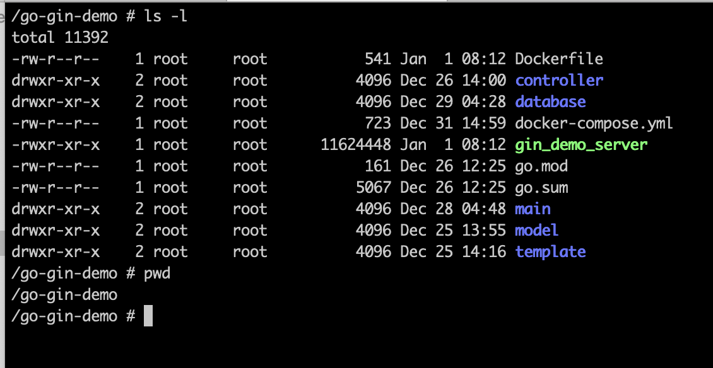

# go-gin-demo
练习docker和go web相关操作，一个简单的go web应用与mysql通信的demo

#构建镜像
Dockerfile用于生成镜像  
$ docker build -t go-gin-demo .  

#启动容器
$ docker run -p 9090:9090 --name=go-gin-demo go-gin-demo

#连接mysql 到 go web
如果mysq和go web应用两个容器之间需要通信，需要进行设置，  
这里用--link参数连接容器，具体参数含义参考搜索引擎结果；
  
$ docker run --link mysql_5.7:mysql_5.7 -p 9090:9090 --name=go-gin-demo go-gin-demo  

#启动mysql容器
$ docker run --name mysql_5.7 -p 3306:3306 -e MYSQL_ROOT_PASSWORD=xxx -d mysql:5.7  

#同时启动
多个容器同时启动，用docker-compose.yml，相应目录运行：
$ docker-compose up -d

关闭并删除容器：  
$ docker-compose down

关闭不删除：  
$ docker-compose stop

#容器目录
容器启动后，目录结构如下图：
